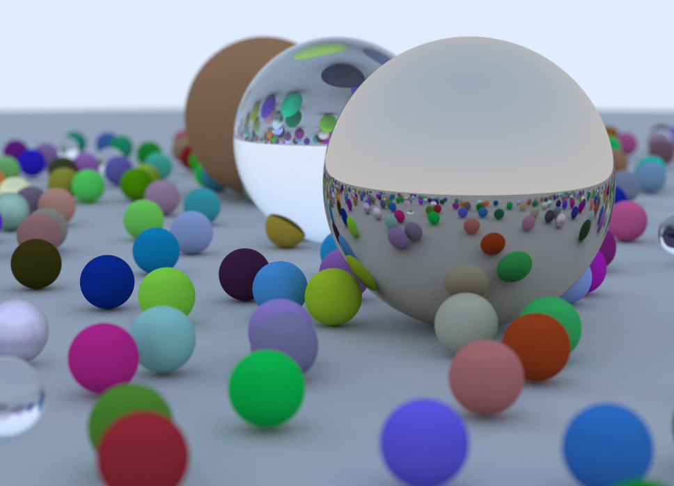
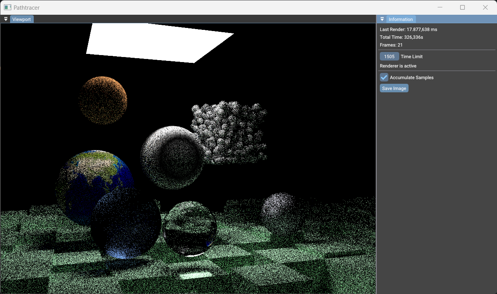

# Pathtracer

This repository contains a Pathtracer, created by following the the Ray Tracing in One Weekend book series available at https://raytracing.github.io/ 

The Pathtracer is currently using the CPU to render as done in the books although the GUI is using Vulkan and ImGUI using [Catalyze](https://github.com/JensKrumsieck/Catalyze).

#### Ray Tracing in One Weekend
[Branch for finished Book 1](https://github.com/JensKrumsieck/RayTracingInOneWeekend/tree/Book-1)

#### Ray Tracing: The next Week
[Branch for finished Book 2](https://github.com/JensKrumsieck/RayTracingInOneWeekend/tree/Book-2)

#### Ray Tracing: The Rest of Your Life
Is currently being built in the master-branch

#### Screenshots & Rendered Images

### GPU Version?
[Compute Shader Raytracing](https://github.com/JensKrumsieck/raytracing-vulkan)
